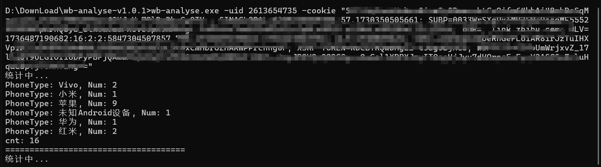

编译好的可执行文件在release页面：https://github.com/x1uc/comment_user_analysis/releases/

可执行文件执行方式：
```shell
wb-analyse.exe -uid xxxx -limit xxxx -cookie "xxxxxx"
```



源代码执行方式
```shell
go run main.go -uid xxxx -limit xxxx -cookie "xxxxxx"
```

查看帮助

```shell
wb-analyse.exe -help
```

## 结果

代码执行结束之后会生成两个html文件，分别是对应用户的饼图和柱状图(uid-phone-stats.html,uid-phone-pie.html)


