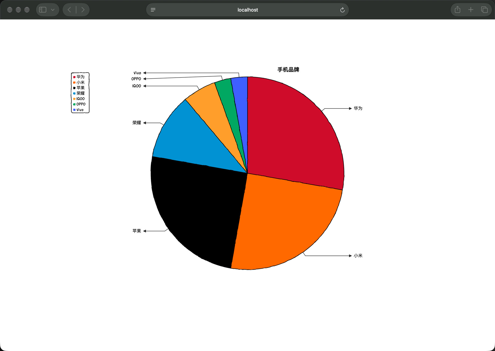

# comment_user_analysis

从微博评论里找出用户正在使用的手机品牌，写入 SQLite，并用 [chart.xkcd](https://github.com/timqian/chart.xkcd) 画出品牌饼图。



## 运行

在仓库根目录执行，程序会读取当前目录的 `config.toml`：

```bash
go run ./cmd
```

每次运行生成一个批次号。这一轮写入数据库的记录都带上同一个 `batch_id`。饼图写到 `output/phone_brand_pie<批次号>.html`，用浏览器打开即可。页面需要能访问 jsDelivr，以便加载 chart.xkcd。

## 配置

```toml
cookie = ""
rate_limit = "1s"
default_order_type = "popular" # popular 或 timeDesc
db_path = "test.db"

[[blogs_infos]]
blog_base62_id = "Rj9XIxaID"
comment_amount = 20
order_type = "" # 留空则使用 default_order_type
```

| 字段 | 说明                                                  |
|---|-----------------------------------------------------|
| `cookie` | 微博登录 Cookie，必填                                      |
| `rate_limit` | 两次请求之间的最短间隔，Go duration 格式。未填写时为 `5s`               |
| `default_order_type` | 评论排序。`popular` 按热度，`timeDesc` 按时间降序。未填写时为 `popular` |
| `db_path` | SQLite 文件路径。未填写时为 `data.db`                         |
| `blog_base62_id` | 微博短链里的文章 ID。blog_base62_id 和 blog_id 两个字段填写一个即可                                        |
| `blog_id` | 数字文章 ID。blog_base62_id 和 blog_id 两个字段填写一个即可         |
| `comment_amount` | 这篇微博要拉取的评论条数。未填写时为 `20`                             |
| `order_type` | 这篇微博的排序。留空时使用 `default_order_type`                  |

