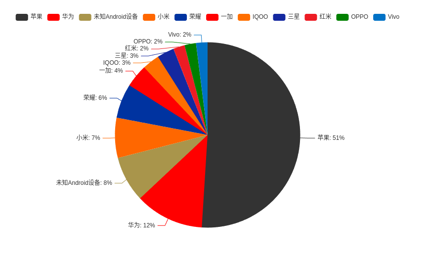

# 微博用户手机品牌分析工具

一个用于分析微博用户手机品牌分布的工具，支持统计用户评论者的手机品牌并生成可视化图表。

## 使用方法

创建 `config.json` 文件：

```json
{
  "uid": "需要的用户UID",
  "cookie": "你的微博Cookie",
  "limit": 100,
  "output_dir": "./output"
}
```

运行 
```
go mod tidy

go run cmd/main.go
```

## 运行结果

### 目录结构
```
output/
└── {用户ID}/
    ├── pie.html          # 手机品牌饼图
    ├── stats.html        # 手机品牌柱状图
    ├── summary.txt       # 统计摘要报告
    └── stats.txt         # 实时统计数据（用户ID:设备）
```

### 统计饼图


### 统计柱状图


### 统计明细
[统计明细](./output/2397417584/stats.txt)

### 统计汇总
[统计汇总](./output/2397417584/summary.txt)


## FAQ

如果不能使用，请修改 intermal/client/client.go 中的 setHeaders ，保证和当前微博网页端同步